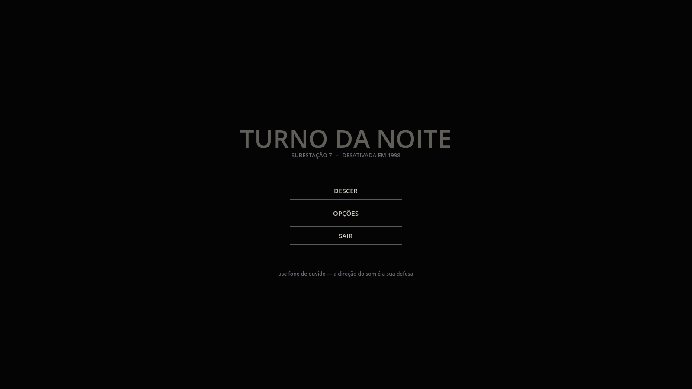
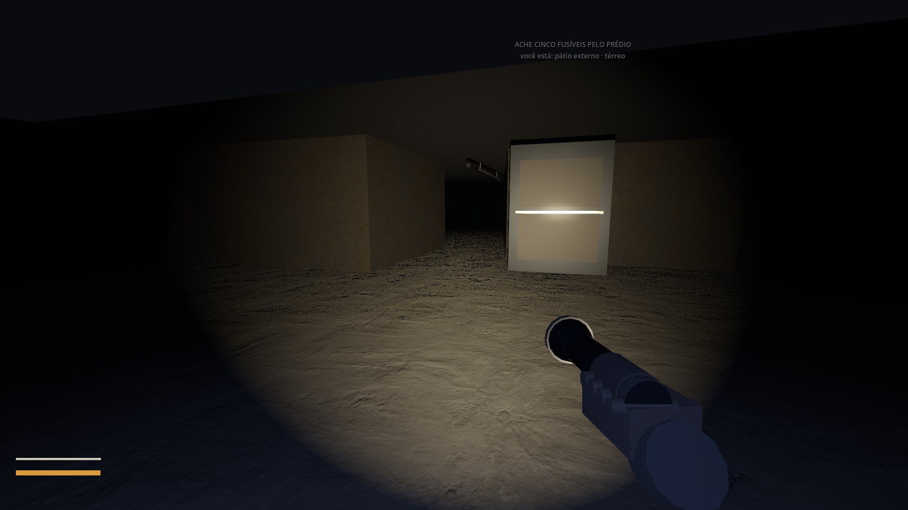
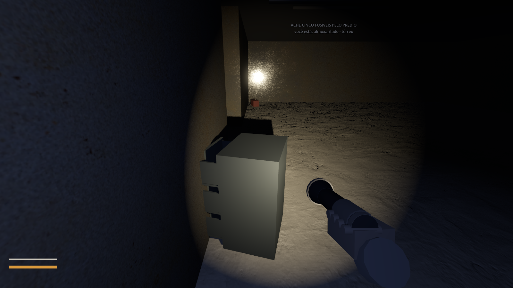
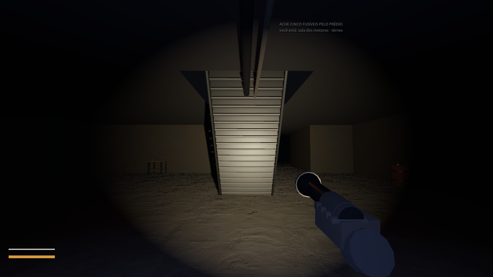
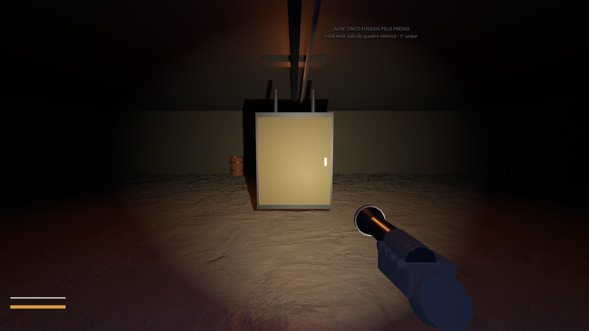
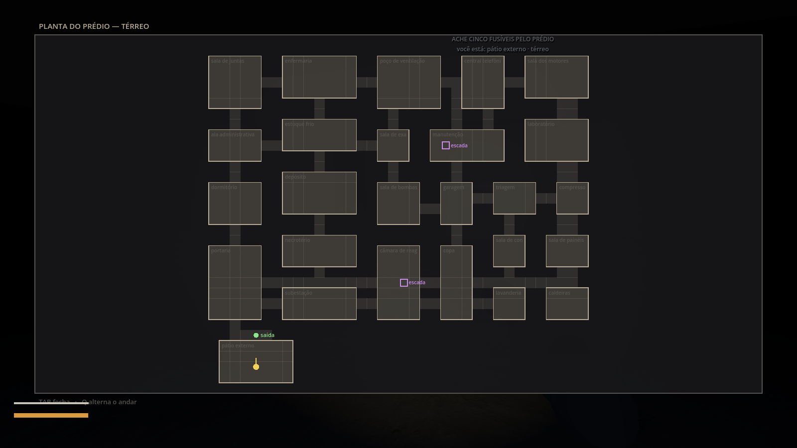
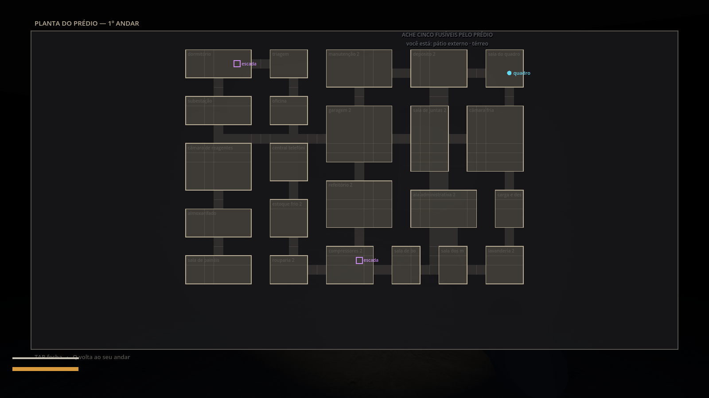
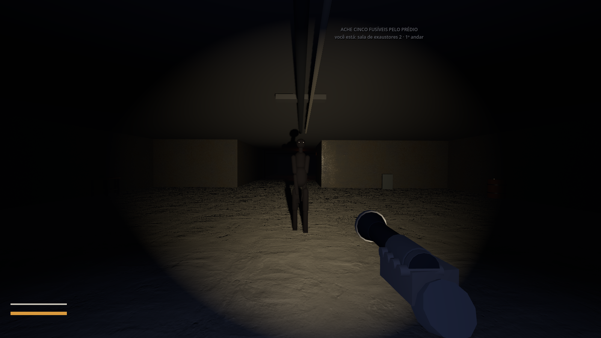

# Turno da Noite — como está hoje

Todas as imagens saem do próprio jogo, pelo modo de captura
(`--screenshot`, em `game/godot/scripts/Bootstrap.cs`). Nenhuma foi
montada ou retocada: é o que aparece na tela.

Para regerar: rode o Godot com `--screenshot` mais a flag da cena que
quiser (`--verrecipiente`, `--verescada`, `--vercima`, `--vermapa`,
`--vermapacima`, `--vercriatura`).

---

## A abertura

## O pátio, antes de entrar

Você começa do lado de fora. Entrar pela porta da frente é a primeira
coisa que você faz — e dá peso ao momento em que ela bate atrás de você,
quando o primeiro fusível sai do lugar.

## Revistar

Os fusíveis não ficam largados no chão: estão dentro de caixas de
ferramenta, gaveteiros e prateleiras. A maioria dos móveis está vazia, e
revistar faz barulho. As gavetas saem de verdade.

## A escada

O prédio tem dois andares, e o quadro elétrico fica em cima: subir com os
fusíveis na mão é o que faz a escada servir para alguma coisa. São duas,
nunca uma — com uma só, o andar de cima vira ratoeira sem saída. O teto
tem buraco em cima delas.

## O andar de cima

## A planta do prédio

O mapa é um item que se acha, guardado num móvel do térreo. E ele não
mostra o prédio inteiro: desenha o que você já andou, célula por célula.
Mapa completo de graça resolveria o jogo, e o jogo é estar perdido.

TAB abre, Q alterna entre os andares.

## Ela

Montada em código, e não baixada. O único modelo CC0 disponível era um
demônio rosa de desenho, com auréola e forquilha — pintar de preto não
resolvia, porque o que entregava a piada era a silhueta. Está guardado em
`assets/modelos/nao-usados/`, com a explicação.

Esta é alta demais para ser gente, magra, com braços que chegam ao chão,
sem rosto, dois olhos acesos. A caminhada é feita à mão: pernas e braços
em oposição, no ritmo da velocidade real dela.

